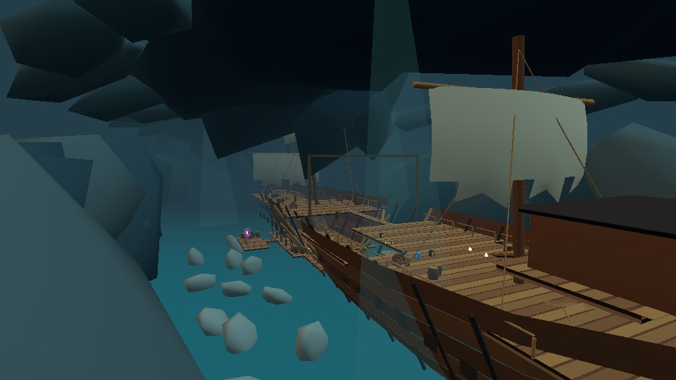

# The Drowned Crown

A giant wrecked galleon in a moonlit underground sea, built for exploration and platforming. The hull spans 160 metres; the supported main route covers approximately 416 metres through winding mine passages, a boarding ramp, broken decks, a lower cargo hold and a treasure vault. The camera follows ordered route nodes through the turns and height changes.

The main route has two charged jumps and four checkpoints. Optional paths include the crystal grotto, captain's cabin, a powder-room jewel, a fallen-mast grind, port rigging and a loose halyard. A swinging anchor guards the high shortcut. The lower hold provides the broad route through the wreck.

Source geometry is in `src/levels/pirate-wreck.ts`, with the small authoring mesh toolkit in `pirate-meshes.ts`. The level uses the existing `mesh`, wall, rail, rope, pendulum, torch, crate, checkpoint and gate contracts. Shared movement tuning is unchanged. Editor data includes every authored triangle and palette color, with bounded indexed meshes; there is no asset URL or new runtime asset loader.

## Custom Meshy props

Three original Meshy T2 Smart Topology props were generated and textured through the official CLI: naval cannon (2,610 triangles), open treasure chest (2,325), and skull monument (2,698). The skull is mounted on stone pillars above the treasure tunnel; its mouth is not treated as a traversable opening. Texture colors are baked to twelve palette materials per prop for the retro look and small editor payload.

The six generation/texturing jobs consumed **45 existing credits**. The user explicitly authorized Meshy jobs while the account contains credits and prohibited buying credits or upgrading. No purchase or upgrade was performed. `tools/pirate-wreck/tasks.json` records operation/task IDs and consumption; `asset-manifest.json` records original GLB hashes. Credentials and signed download URLs stay outside public and committed files. Original generated GLBs remain in ignored `.img2threejs/pirate-wreck`.

## Verification

- `tools/test-pirate-wreck.mjs`: editor round-trip and a continuous real-Player input journey from supported spawn through both jumps, four checkpoints and the finish gate.
- `tools/test-pirate-wreck-safety.mjs`: actual pit death/automatic respawn, checkpoint death/respawn, solid mast collision, powder-room crystal and return, captain's cabin ascent, secret mine grotto.
- `tools/pirate-wreck-browser.mjs`: real Chrome lite/full rendering, ordinary input samples in the live game loop, scene captures and console errors.
- `tools/pirate-wreck/capture_previews.mjs`: actual rendered level thumbnails and desktop/mobile Hidden Shores menu review.
- `npm run check:levels`, `npm run build`, plus focused campaign and Level Select checks. Full suite is not part of this iteration.

First playable continuous route: **16.8 minutes** after the recorded prompt (10:53:08 to 11:09:55 UTC, 2026-10-02). Meshy integration, optional routes, menu review and publishing continued after that milestone.

The level is available as **The Drowned Crown** in **Hidden Shores**. This map region also connects Bone Yard and Tidebreak · Crab Chief. Existing newer course entries remain in their authored regions.

